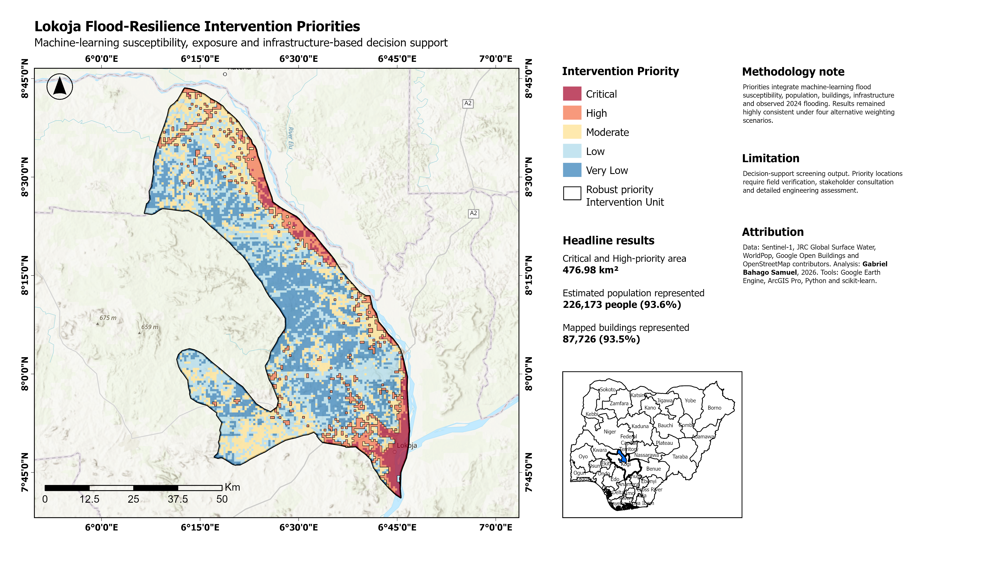

# Lokoja Flood Resilience Dashboard

An interactive, licence-independent WebGIS for exploring flood susceptibility,
historical flood evidence, population and building exposure, infrastructure
screening, and intervention priorities across Lokoja Local Government Area,
Nigeria.

**[Explore the live dashboard](https://bahagogabriel.github.io/lokoja-flood-resilience-dashboard/)**



## Project overview

Lokoja lies near the confluence of the Niger and Benue rivers and experiences
recurring flood impacts. This project moves beyond producing a flood map: it
combines multi-event satellite observations, machine-learning susceptibility,
population and building exposure, and mapped infrastructure into transparent
600 m planning units that support intervention screening.

The dashboard enables users to:

- explore Critical, High, Moderate, Low and Very Low intervention-priority
  classes;
- compare recommended intervention themes;
- switch between classified and continuous susceptibility surfaces;
- inspect mapped flood extents for 2018, 2020, 2022 and 2024;
- display robust-priority units, critical facilities, bridges and fords, and
  high-risk road sample points; and
- click individual planning units and assets to inspect their attributes.

## Headline results

| Indicator | Result |
|---|---:|
| Rasterized Lokoja LGA area | 3,396.41 km² |
| Planning units assessed | 9,833 |
| Robust Critical/High planning units | 1,475 |
| Critical/High priority area | 476.98 km² |
| Population represented in Critical/High units | 226,173 people |
| Mapped buildings represented in Critical/High units | 87,726 |
| Active intervention units | 3,934 |
| Active intervention area | 1,340.25 km² |
| High/Very High susceptibility road exposure | 7.49 km |
| Priority bridges and fords | 24 |
| Priority critical facilities | 1 |

## Analytical workflow

1. **Multi-event flood inventory** — Sentinel-1 SAR evidence was used to map
   flood extents for 2018, 2020, 2022 and 2024 while permanent water was
   excluded from the modelling domain.
2. **Predictor engineering** — Seventeen terrain, hydrological, surface-water
   and land-cover variables were assembled on a 30 m grid.
3. **Model comparison** — Logistic Regression, Random Forest and Histogram
   Gradient Boosting were compared using spatially blocked cross-validation.
4. **Independent validation** — The selected Random Forest model was evaluated
   against the independently held-out 2024 flood observation.
5. **Exposure assessment** — Official constrained WorldPop, Google Open
   Buildings and OpenStreetMap infrastructure were aligned to the model grid.
6. **Intervention screening** — Hazard, exposure, infrastructure and observed
   flooding were summarized within 600 m planning units and tested under four
   weighting scenarios.
7. **WebGIS delivery** — The analytical outputs were converted to portable
   GeoJSON and image overlays and published as this MapLibre dashboard.

## Model performance and robustness

- Mean population-weighted spatial PR-AUC: **0.813**.
- Independent 2024 PR-AUC: **0.839**.
- Independent 2024 ROC-AUC: **0.999**.
- The Very High susceptibility class contained **96.64%** of the mapped 2024
  flood cells.
- Removing water occurrence reduced mean spatial PR-AUC from **0.813** to
  **0.649**, so both full and ablated results were retained as an important
  sensitivity check.
- Chronological transfer tests achieved overall PR-AUC values of **0.669** for
  2020, **0.716** for 2022 and **0.842** for 2024 using the full predictor set.

## Intervention themes

The final planning units support six recommended themes:

- Community preparedness and local drainage
- Floodplain restoration and water retention
- Road drainage and access continuity
- Crossing and access resilience
- Critical-facility resilience
- Monitoring and land-use control

## Technology

- Google Earth Engine and Sentinel-1 SAR
- ArcGIS Pro and ArcPy
- Python, NumPy, pandas and scikit-learn
- Random Forest classification
- MapLibre GL JS, GeoJSON and JavaScript
- GitHub Pages

## Repository structure

```text
.
├── index.html
├── app.js
├── styles.css
├── project_summary.json
├── webgis_manifest.json
├── data/
│   ├── lokoja_intervention_planning_units.geojson
│   ├── lokoja_robust_priority_units.geojson
│   └── infrastructure GeoJSON layers
├── overlays/
│   ├── susceptibility image overlays
│   └── 2018–2024 flood image overlays
└── assets/
    └── project preview image
```

## Run locally

The dashboard loads local data with `fetch`, so it should be served through a
local web server rather than opened by double-clicking `index.html`.

```powershell
python -m http.server 8000
```

Then open `http://localhost:8000`.

## Responsible interpretation

This is a strategic decision-support screening product. It does not model
flood depth, velocity, duration, return period, physical damage or financial
loss. Satellite-derived flood labels may contain classification uncertainty,
and WorldPop, Google Open Buildings and OpenStreetMap have different reference
periods and completeness levels. Priority locations therefore require field
verification, stakeholder consultation, environmental assessment and detailed
engineering appraisal before implementation.

## Data attribution

The workflow uses data derived from Sentinel-1, JRC Global Surface Water,
WorldPop, Google Open Buildings, OpenStreetMap contributors and other global
terrain and land-cover products. Basemap tiles in the dashboard are attributed
to OpenStreetMap contributors.

## Author

**Gabriel Bahago Samuel**  
GIS Analyst, MECON Services Ltd., Jos, Nigeria  
[LinkedIn](https://www.linkedin.com/in/bahagogabriel)
